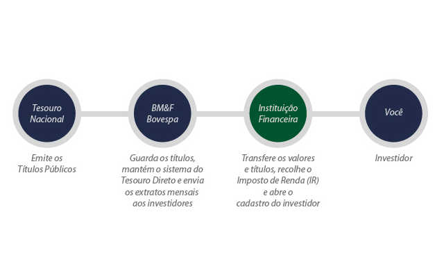

# Tesouro Direto
* Programa desenvolvido pelo Tesouro Nacional em parceria com a BM&FBOVESPA, para a realização de venda de titulos publicos por meio da internet. 
* Objetivo principal de realizar a democratização do acesso aos titulos publicos, permitindo que investimentos a partir de R$30,00 fossem realizados.
* Contribuiu para a diversificação e complementação das alternativas de investimentos, oferencendo titulos com diferentes taxas de rentabilidade (prefiixada, ligada a inflação, ligada a taxa de juros basica, etc), de prazos de vencimento e fluxos de remuneração.

## Titulos Publicos
* Ativos de renda fixa, que pode ter seu rendimento mensurada no momento da compra, diferentemente de ativos de renda variável, como ações.
* Por possuir uma voltalidade mais baixa que ativos de renda variável, são considerados investimentos de risco baixo, para investidores mais conservadores.
* Ao comprar um título, você empresa dinheiro ao estado para realizar projetos de interesse nacional, e em volta recolhe uma remuneração pelo empréstimo, o valor investido acrescido do juros do emprestimo.
* Dessa maneira, alem de se beneficiar financeiramente, você auxilia o país a realizar projetos de desenvolvimento em saúde, educação, infraestrutura, etc.
* Vale ressaltar que estes titulos são negociados somente como escrituras, nao existindo um titulo fisico a ser possuido. Quando uma compra é realizada, aquele título fica associado ao seu CPF, podendo ser consultado à qualaquer momento.
### 1. Títulos Prefixados
* Você sabe exatamente a rentabilidade que ira obter em caso de manter o título até seu vencimento;
* Cada unidade de título renderá em valor bruto R$1.000,00;
* Indicados à serem comprados quando a taxa de juros(**Selic**) for se manter menor do que a taxa acordada no título;
* Possui rendimento nominal, ou seja, seu lucro só será encontrado após descontado a inflação;
* Títulos Prefixados (**LTN**) ou Titulos prefixado com juros semestrais (**NTN-F**). 
* Titulos prefixados padrões são bastante indicados para o investidor que possui a disponibilidade de manter o seu investimento parado até a sua data de vencimento, se beneficiando assim de juros compostos mais significativos, menor imposto sobre renda e como resulante um valor final maior. Esse titulo é bastante indicado também quando acredita-se que a taxa de juros irá diminuir ao longo do tempo.
* Titulos prefixados com juros semestrais são indicados para individuos que gostariam de manter uma linha de investimento, porém não usufurem da capacidade de manter o dinheiro parado como investimento, e necessitam de pagamentos semestrais para manter sua sobrevivencia. Apesar de pagamentos periodicos, esse investimento acaba por pagar valores menores para um mesmo tempo investido, uma vez que além dos pagamentos periodicos, o imposto sobre a renda aplicado também varia ao longo do tempo, diminuindo assim os juros compostos e aumentando o abate por parte do estado.
### 2. Titulos Pós-fixados
* Tem seu valor corrigido por um indexador, podendo este ser:
  1. Taxa basica de juros (**Selic**);
  2. Inflação (**IPCA**)
* Rentabilidade composta por taxa prefixada adicionado à variação do indicador;
* Tesouro Selic(**LFT**), Tesouro IPCA+(**NTN-B Principal**), Tesouro IPCA+ com Juros semestrais(**NTN-B**)

## Passo a Passo 
1. CPF e Conta Corrente ativa
2. Agência financeira intermediaria de transações com o Tesouro Direto (Agência de Custódia). Cada uma possui taxas diferentes, vale a pena pesquisar antes de escolher.
3. Cadastrar-se na agência de custódia, fornecendo documentação necessária.
4. Senha provisória de acesso ao site do Tesouro Direto.
5. Atualizar senha de acesso ao site do Tesouro Direto. (letras, numeros e caracteres especiais).
6. Comprar titulos (Orientador Financeiro)

## Canais de aplicação
1. **Site do Tesouro Direto**: Aplicações podem ser realizadas diretamente pela area restrita do site. Compra, venda, programação de investimentos, consulta à extrato, etc.
2. **Através do site da Agência de custódia**: A agência realizou a integração do seu site com o do Tesouro Direto, permitindo realizar aplicações por la com as mesmas taxas do site do Tesouro Direito.
3. **Por meio da Agência de Custódia**: Você autoriza a agência a realizar aplicações por você. Algums agencias disponibilizam esta funcionalidade.

## Modalidades de Aplicação
1. **Investimento Tradicional**
  * Operações de compra e venda que pode ser realizadas à qualquer momento do dia, enquanto a plataforma estiver aberta.
  * Permite a seleção do titulo à ser comprado. O valor da transação pode ser ajustada por quantidade de titulos ou valor total do montante.

2. **Investimento Programado**
  * Contempla o agendamento de compras e vendas, reaplicação dos juros e do valor a ser resgatado nas datas de vencimento.
  * Representa uma conveniência para auxiliar o planejamento de finanças.
  * As transações serão realizadas sob os preços e taxas vigentes no dia de liquidação das operações programadas.
  * Todos os agendamentos feitos podem ser cancelados, editados ou consultados até um dia antes da sua data de processamento.

## Vantagens do Tesouro Direto
1. **Segurança**
  * Titulos publicos sao ativos de baixo risco por serem totalmente garantidos pelo Tesouro Nacional, ou seja, o Governo Federal garante seu pagamento.
  * O Titulo fica associado ao CPF, permitindo ao comprador trocar de agencia de custodia sem necessitar se desfazer de seus titulos anteriores.
  * Todos os titulos podem ser consultados atraves do _Canal Eletronico do Investidor_ (CEI).

2. **Alta Rentabilidade**
  * Rendimento competitivo quando comparado ao de fundos de investimento.
  * Imposto de renda cobrado somente na venda de titulos, recolhimento de juros ou vencimento do titulo.
  * Taxas de administração e de custódia baixas.
  * **Taxa de custódia**: 0.3% ano ano. Serviço de guarda dos titulos e informações de movimentação e saldo.
  * **Taxa da instituição financeira**: varia de 0 a 2% ao ano.
  * Quanto maior o volume de investimento, menor geralmente são as taxas. taxa de 0.5% para investimentos de R$30.00 no Tesouro Direto.
  * **Tributação** identica às incidentes em operação de renda fixa. 
  >> 22.5% ate 180 dias.  
  >> 20% de 181 a 360 dias.  
  >> 17.5% de 361 a 720 dias.  
  >> 15% acima de 720 dias.
  * Não existe efeito come cotas (cobrança de imposto de renda de 6 em 6 meses realizado por fundo de investimentos).

3. **Liquidez**
  * Garantida pelo Tesouro Nacional, que recompra todos os titulos que o investidor desejar todos os dias.
  * Recompra de titulos em periodo de funcionamento da plataforma utilizam o preço vigente no momento da operação.
  * Recompras fora desse horario ou durante o fim de semana/feriados utilizam o valor na abertura da plataforma no dia util seguinte.
  * Enquanto a plataforma está fechada, os preços consultaos são apenas uma referencia.
  * A liquidação de uma operação realizada em D+0 acontece sempre em D+1, onde **D** significa o dia util em que a operação foi registrada, e o **+1** representa o valor em dias uteis em que a operação será realizada.

4. **Acessibilidade** 
  * Investimento minimo de apenas R$30.00
  * requisitos minimos são: possuir CPF e conta-corrente em instituição financeira.
  * Não necessita de diplomas ou conhecimentos especializados para se iniciar.
  * Não exige que o investidor deixe o conforto de sua casa, realizando todas as operações pelo seu computador através da internet.

5. **Flexibilidade**
  * Tesouro Direto lhe permite planejar seus lucros.
  * Flexibilidade de titulos e ações de acordo com o perfil e objetivo.
  * Oferece titulos prefixados, indexados á taxa Selic ou à inflação.
  * Prazos e datas de vencimentos variados, permitindo a adequação de sua carteira de investimentos à sua necessidade financeira.
  * Fluxos de pagamento em vencimento ou semestral.
  * Quando os titulos sao comprados, sua data de vencimento indica a data limite em que você ira receber o retorno do seu investimento. Caso você necessita resgatar o valor deste titulo anteriormente à seu vencimento, o Tesouro Nacional garante a recompra do seu titulo, aplicando uma taxa de tributação referente ao tempo de maturidade do investimento.

## Instituições brasileiras habilitadas
* Também chamadas de agentes de custódia;
* Bancos ou corretoras que podem operar com o Tesouro Direto;
* Responsáveis por realizar o cadastro de investidores junto a BM&FBOVESPA, além de intermediar a transferência de recursos financeiros e títulos;
* Agentes Integrados são aqueles que possuem seus sistemas integrados com o do Tesouro Direto, permitindo e facilitando assim a compra e venda de titulos por meio do site do proprio agente;
* Quando você compra titulos, estes sao mantidos em uma _conta de custódia_ na BM&FBOVESPA aberta em seu nome, permitindo que investidores mudem de corretora sem que seus investimentos fiquem em risco;

* Instituições integradas, permitem programação e sem taxa:
  1. EasyInvest
  2. Guide Investimentos
  3. H.Commcor DTVM
  4. Modal DTVM
  6. Grupo XP
  7. XP Investimentos
